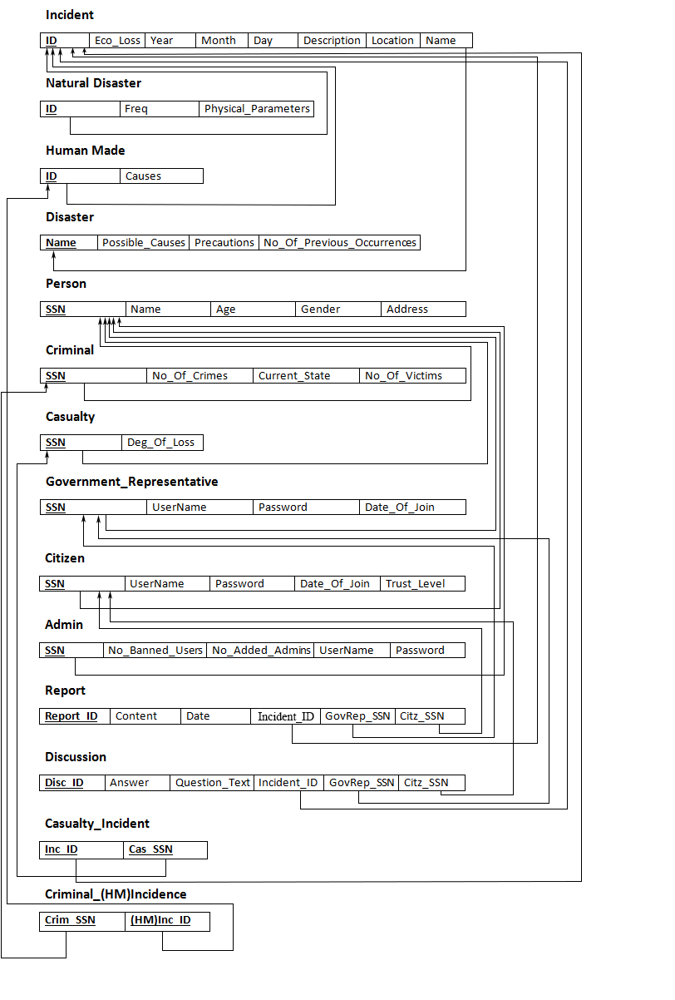

# Disasters

## Brief Description

This is a locally hosted web application based on a database that can hold different types of worldwide disasters (whether they're 
natural or man-made disasters). It allows also users to login, ask or answer questions about some incidents based on their level of trust 
and their type.

Note: This project is the course project for the college Database Systems course.

## Utilized Technologies and Frameworks

- HTML & CSS.
- Bootstrap. 
- PHP Laravel.
- KoolReport.
- MySQL.
- PHPMyAdmin.

## Repository Structure

- First, we have the sql files in the main folder, as follows:
1) database_schema.sql: for defining the database schema in SQL Server.
2) database_schema_mysql.sql: for defining the database schema in MySQL.
3) cas_cri.sql / data_insertion.sql / disasters.sql / incidents.sql: queries for the data insertion in the database.

- Second, the "Disasters" folder:
This folder contain the Laravel project of the web application.

## Database Schema

